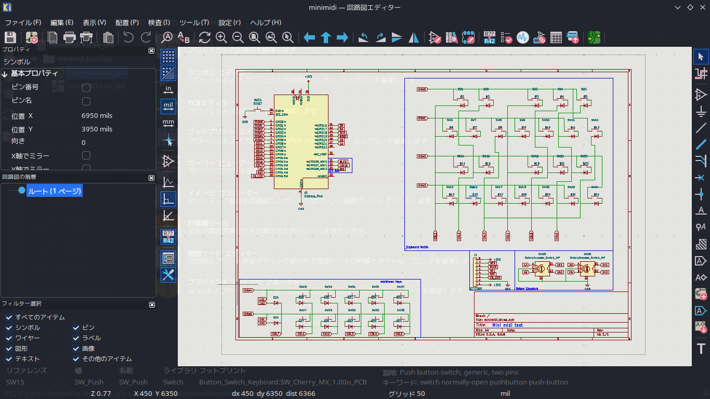
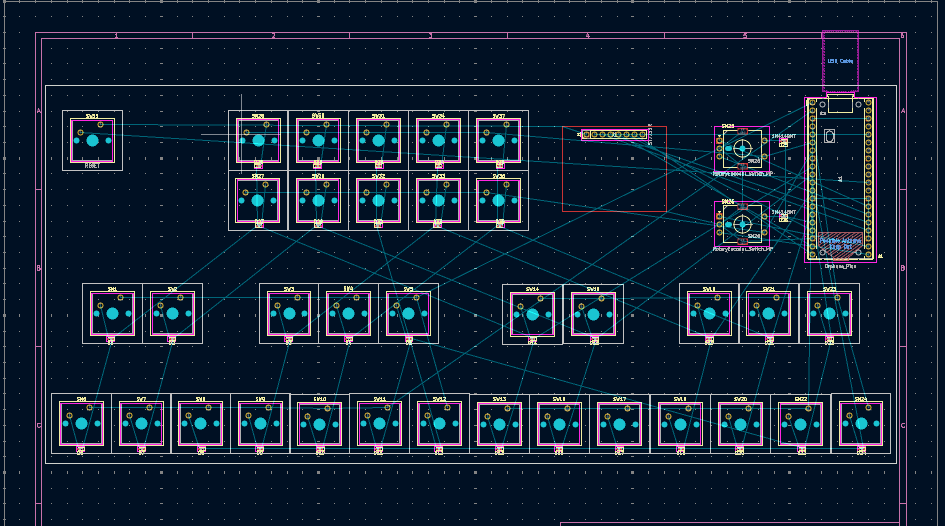
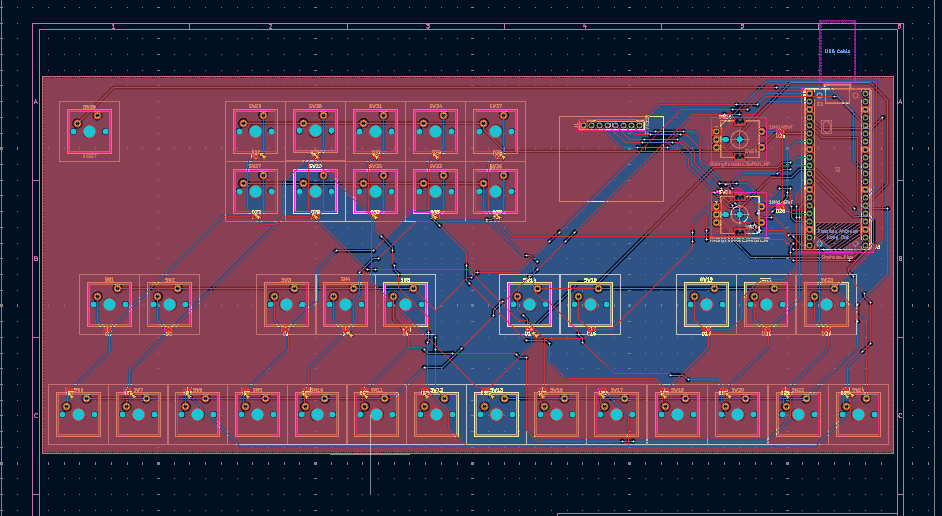
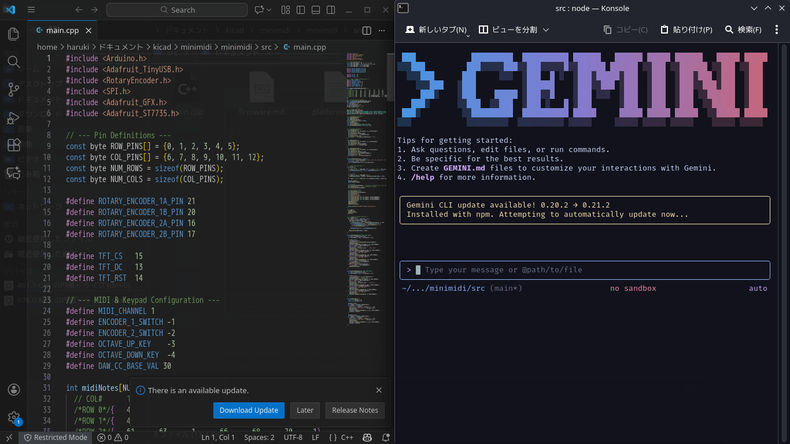
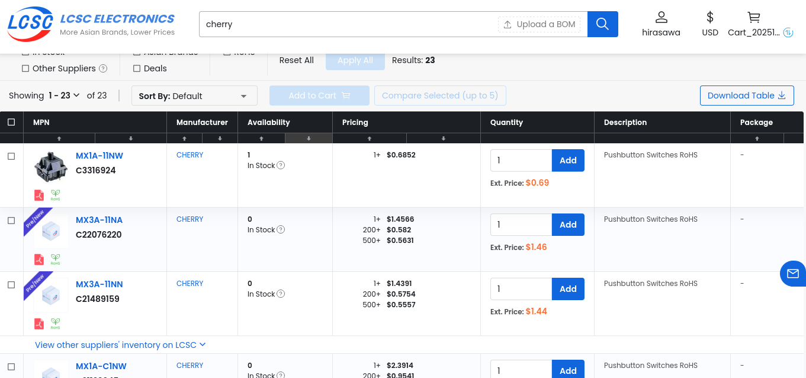

# Little mini midi
## Description of this project.
This is my first midi keyboard.  
I used to https://blueprint.hackclub.com/starter-projects/midi as a reference.  

I was thinking I wish I could making songs with midi keyboard that graphical and useful.
So I maked this midi keyboard.

## Screenshots
Schematic  
  
PCB(Layout)  
  
PCB(Final version)  
  
Programming  
  
## Estimates
JLCPCB Estimate  
  
LCSC Estimate  
  

## BOM
|Name           |Quantity|
|---------------|--------|
|Cherry MX Key  |35      |
|PinHeader 1x08 |1       |
|Diode          |36      |
|RotaryEncoder  |2       |
|RP Pi Pico     |1       |
|PinHeader 1x20 |2       |